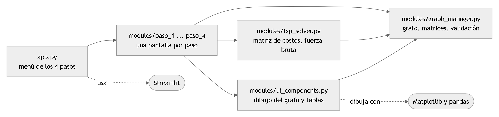
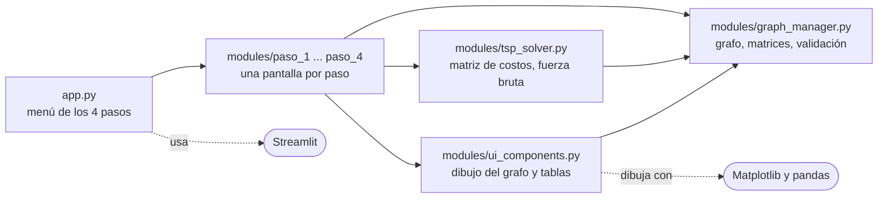
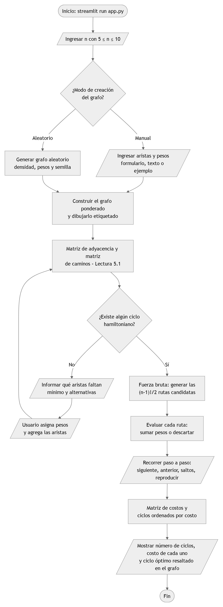
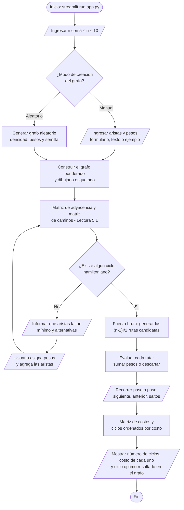
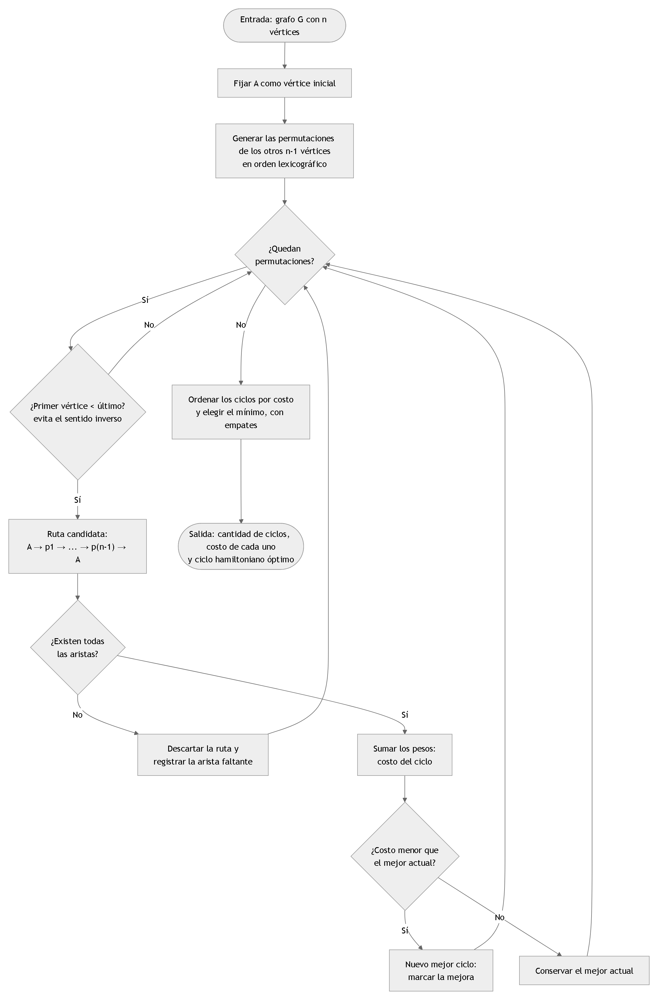
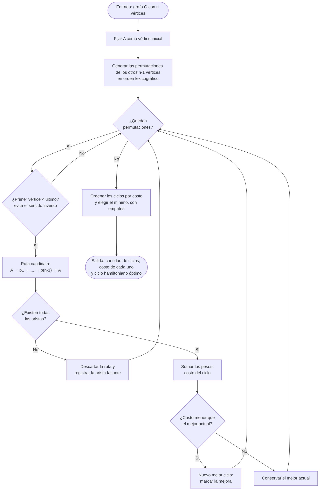

# Documentación técnica — Problema del Agente Viajero por fuerza bruta

**Curso:** 1AMA0726 – Matemática Computacional · **Proyecto 2026-20 · Problema 4** (Agente viajero)
**Lenguaje:** Python 3 (interfaz web con Streamlit, ejecución local sin conexión)

## Contenido

1. [Descripción general del programa](#1-descripción-general-del-programa)
2. [Desglose funcional de cada módulo](#2-desglose-funcional-de-cada-módulo)
3. [Justificación técnica de las librerías](#3-justificación-técnica-de-las-librerías)
4. [Diagrama de flujo del sistema](#4-diagrama-de-flujo-del-sistema)
5. [Análisis de las lecturas del curso](#5-análisis-de-las-lecturas-del-curso)
6. [Formato de figuras según normas APA](#6-formato-de-figuras-según-normas-apa)
7. [Resultados de verificación y caso de estudio](#7-resultados-de-verificación-y-caso-de-estudio)
8. [Guía de ejecución local en Visual Studio Code](#8-guía-de-ejecución-local-en-visual-studio-code)
9. [Guía de despliegue gratuito en la nube](#9-guía-de-despliegue-gratuito-en-la-nube)
10. [Referencias](#10-referencias)

---

## 1. Descripción general del programa

La aplicación resuelve el **Problema del Agente Viajero (TSP)** sobre un grafo **no dirigido y ponderado** con `n` vértices, `n ∈ [5, 10]`, mediante **fuerza bruta**: genera todos los ciclos hamiltonianos posibles, calcula el costo total de cada uno y elige el de menor costo (distancia, costo o tiempo, según lo que representen los pesos).

El código usa solo lo básico de Python: **funciones, `for`, `if`, listas y diccionarios**. No hay clases ni decoradores, de modo que cada parte se puede leer y explicar de arriba hacia abajo.

El usuario recorre cuatro pasos (se eligen con botones en la parte superior de la pantalla):

| Paso | Qué hace | Requisito del enunciado |
|---|---|---|
| **1. Grafo** | Pide `n` (solo acepta 5 a 10), permite crear el grafo en modo **Manual** (arista por arista, con ejemplos) o **Aleatorio**, y lo dibuja con letras y pesos. | Número de nodos, modo manual/aleatorio, gráfico etiquetado. |
| **2. Validación** | Muestra la matriz de adyacencia, la matriz de caminos y las componentes conexas. Dice si existe un ciclo hamiltoniano y, si no, **qué aristas faltan** (mínimo y alternativas); permite agregarlas con su peso. | Verificación de ciclos hamiltonianos y aristas faltantes. |
| **3. Paso a paso** | Ejecuta la fuerza bruta y permite recorrer las rutas una por una (Anterior, Siguiente, +10, +100, Sig. mejora, Final), viendo cómo se suma cada arista. | Avance iterativo, generación y evaluación de rutas. |
| **4. Resultados** | Matriz de costos, cantidad de ciclos, costo de cada ciclo (ordenados de menor a mayor), ciclo óptimo resaltado y empates. | Matriz de costos, comparación y solución óptima. |

**Ideas clave del algoritmo**

* **Se fija A como inicio.** Un ciclo no tiene principio ni fin, así que no se pierden soluciones y las rutas pasan de `n!` a `(n-1)!`.
* **No se repite el sentido inverso.** En un grafo no dirigido, `A→B→C→A` y `A→C→B→A` son el mismo ciclo; por eso solo se evalúa la mitad: `(n-1)!/2` rutas (Lectura 7).
* **Rutas inválidas.** Si una ruta usa una arista que no existe, su costo es infinito y se descarta.
* **Empates.** Si varios ciclos tienen el costo mínimo, se muestran todos.

### Estructura del proyecto

```text
proyecto matematica/
├── ejecutar.py                 Botón ▶: abre la aplicación
├── app.py                      Menú principal (45 líneas): elige y muestra el paso
├── requirements.txt            Librerías necesarias
├── modules/
│   ├── __init__.py
│   ├── graph_manager.py        LÓGICA: grafo, matrices y validación de aristas faltantes
│   ├── tsp_solver.py           LÓGICA: matriz de costos y fuerza bruta
│   ├── paso_1_grafo.py         PANTALLA del paso 1: construir el grafo
│   ├── paso_2_validacion.py    PANTALLA del paso 2: validar y aristas faltantes
│   ├── paso_3_fuerza_bruta.py  PANTALLA del paso 3: fuerza bruta paso a paso
│   ├── paso_4_resultados.py    PANTALLA del paso 4: matriz de costos y óptimo
│   ├── ui_components.py        Dibujo del grafo, tablas y pie de figura
│   └── estado.py               Datos que comparten los pasos
├── tests/test_modules.py       12 pruebas de la lógica
├── figuras/                    Diagramas de flujo (.mmd y .png)
├── DOCUMENTOS DE AYUDA/        Lecturas, enunciado, rúbrica y plantilla (no son código)
├── explicacion_codigo.md       Este documento
├── explicacion_codigo.txt      Copia idéntica en texto plano
└── reparticion_exposicion.txt  Guía de exposición para 6 estudiantes
```

**Figura 1**

*Arquitectura modular del sistema*



*Nota.* Las flechas continuas indican qué módulo usa a cuál; las punteadas, las librerías que emplea cada uno. Elaboración propia.



---

## 2. Desglose funcional de cada módulo

**Cómo se representa el grafo.** Es un diccionario: `{"n": 5, "aristas": {(0, 1): 4.0, (0, 2): 7.0, ...}}`. Los vértices son números (0, 1, 2…) que se muestran como letras (A, B, C…). Cada arista se guarda como `(menor, mayor)` con su peso.

### 2.1 `modules/graph_manager.py` — grafo y validación

| Función | Qué hace |
|---|---|
| `grafo_vacio(n)` | Crea un grafo con `n` vértices y sin aristas. |
| `agregar_arista(grafo, a, b, peso)` | Agrega o actualiza una arista. Devuelve un mensaje de error si `a == b` o el peso no es positivo; si todo está bien, devuelve `None`. |
| `peso_arista(grafo, a, b)` | Peso de la arista `a–b`, o `None` si no existe. |
| `nombre_arista(a, b)` | Texto como `A–C`. |
| `grafo_aleatorio(n, densidad, peso_min, peso_max, con_ciclo, semilla)` | Grafo aleatorio. Con `con_ciclo=True` primero dibuja un ciclo por todos los vértices, así siempre tiene ciclo hamiltoniano. |
| `grafo_ejemplo(n, con_ciclo)` | Ejemplos para la demostración: uno con ciclo y otro (dos grupos unidos por una sola arista) sin ciclo. |
| `matriz_adyacencia(grafo)` | Matriz de 0 y 1: 1 si hay arista. |
| `multiplicar_booleana(x, y)` | Producto de matrices donde `1 + 1 = 1`. |
| `matriz_caminos(grafo)` | **Matriz de caminos** (Lectura 5.1): pone 1 en la diagonal de la adyacencia y la multiplica por sí misma varias veces. |
| `orden_por_unos(caminos)` | Pasos 3 y 4 de la lectura: ordena filas y columnas por cantidad de unos (desempate: el primer 1 más a la izquierda). |
| `componentes_conexas(caminos)` | Agrupa los vértices que se alcanzan entre sí. |
| `grados(grafo)` | Cantidad de aristas de cada vértice. |
| `buscar_aristas_faltantes(grafo)` | Prueba todos los ciclos del grafo **completo** y cuenta cuántas aristas le faltan al grafo actual para cada uno. Devuelve el **mínimo** (0 si ya hay ciclo hamiltoniano) y hasta 5 alternativas. |

**Cómo se calculan las aristas que faltan.** Un ciclo hamiltoniano necesita `n` aristas. Se recorren todos los ciclos posibles de `n` vértices; en cada uno se cuentan las aristas que el grafo no tiene. El ciclo con **menos aristas faltantes** dice cuáles hay que agregar; si el mínimo es 0, el grafo ya tiene ciclo hamiltoniano. Con `n ≤ 10` esto tarda como máximo alrededor de 1 segundo.

### 2.2 `modules/tsp_solver.py` — fuerza bruta

| Función | Qué hace |
|---|---|
| `matriz_costos(grafo)` | Peso de cada arista, `∞` si no existe y 0 en la diagonal (Lectura 5.2). |
| `cantidad_ciclos(n)` | `(n-1)!/2` (Lectura 7). |
| `fuerza_bruta(grafo)` | Genera todas las permutaciones de los vértices 1 a n-1 con `itertools.permutations`, descarta las repetidas al revés (`perm[0] > perm[-1]`) y suma los pesos de cada ruta cerrada. Devuelve la lista de `(ruta, costo)`. |
| `evaluar_ruta(grafo, ruta)` | Detalle tramo por tramo: origen, destino, peso y **acumulado**. Se detiene en la primera arista inexistente. |

Núcleo del algoritmo (`fuerza_bruta`):

```python
for perm in itertools.permutations(range(1, n)):
    if perm[0] > perm[-1]:
        continue                      # mismo ciclo al revés
    ruta = [0] + list(perm)           # A + los demás vértices
    cerrada = ruta + [0]              # y vuelve a A
    total = 0
    for i in range(n):
        total = total + costos[cerrada[i]][cerrada[i + 1]]   # inf si no hay arista
    resultados.append((ruta, total))
```

### 2.3 `modules/ui_components.py` — dibujo y tablas

| Función | Qué hace |
|---|---|
| `dibujar_grafo(grafo, ruta, color_ruta, faltantes)` | Dibuja con Matplotlib: vértices en circunferencia (A arriba), pesos sobre las aristas, ruta resaltada y aristas inexistentes en rojo discontinuo. |
| `mostrar_grafico(fig, donde)` | Muestra la figura en la página o en una columna. |
| `pie_de_figura(numero, titulo, nota, donde)` | Pie de figura en formato APA. |
| `tabla_matriz(matriz, orden)` | Convierte una matriz en tabla con letras y `∞`. |
| `texto_ruta(ruta)` y `formato(numero)` | Textos como `A → C → B → A` y `5` en vez de `5.0`. |

### 2.4 `app.py` y los archivos de pantalla

`app.py` es solo el **menú** (45 líneas): lee `n`, el modo y la unidad de la barra lateral, crea el grafo la primera vez (o cuando cambia `n`) y llama a la función del paso elegido. Cada paso vive en su propio archivo:

| Archivo | Función | Qué muestra |
|---|---|---|
| `paso_1_grafo.py` | `paso_1` | Formulario de aristas (manual) o parámetros (aleatorio), tabla de aristas y el grafo dibujado. |
| `paso_2_validacion.py` | `paso_2` | Veredicto de ciclo hamiltoniano, motivos, alternativas de aristas faltantes, matrices y componentes. |
| `paso_3_fuerza_bruta.py` | `paso_3` | Botón «Ejecutar fuerza bruta», botones de navegación, tabla de tramos con acumulado y ruta dibujada. |
| `paso_4_resultados.py` | `paso_4` | Matriz de costos, métricas, ciclo óptimo resaltado y tabla de todos los ciclos ordenados por costo. |
| `estado.py` | `firma`, `obtener_validacion` | Utilidades compartidas: identificar el grafo y guardar el resultado de la validación para no recalcularlo. |

Los datos que deben conservarse entre clic y clic (`ss = st.session_state`) son: el grafo, el resultado de la validación, la lista de rutas evaluadas y la posición del paso a paso. Cuando el grafo cambia, los resultados guardados dejan de valer (se comparan con `firma(grafo)`).

---

## 3. Justificación técnica de las librerías

| Librería | Dónde | Para qué | Por qué se eligió |
|---|---|---|---|
| **Streamlit** | `app.py`, `paso_*.py`, `ui_components.py` | Interfaz web: botones, deslizadores, tablas, columnas y memoria entre clics (`session_state`). | Permite una interfaz amigable **solo con Python** (Frontend y Backend en un mismo lenguaje), corre sin internet con `streamlit run` y se despliega gratis en Streamlit Community Cloud. Tkinter no da una interfaz web y Flask exige HTML/JavaScript. |
| **Matplotlib** | `ui_components.py` | Dibujar el grafo etiquetado: líneas, textos con los pesos y los vértices (Hunter, 2007). | Control total del dibujo con instrucciones simples (`plot` y `text`). |
| **pandas** | `ui_components.py`, `paso_4_resultados.py` | Mostrar tablas de matrices y de ciclos (McKinney, 2010). | Es el formato de tabla que Streamlit muestra mejor. Se instala junto con Streamlit. |
| `itertools` | `graph_manager.py`, `tsp_solver.py` | `permutations` genera todas las rutas. | Está incluida en Python y hace evidente que es fuerza bruta. |
| `math` | `tsp_solver.py`, `ui_components.py` | Factorial y coordenadas de los vértices. | Incluida en Python. |
| `random` | `graph_manager.py` | Grafos aleatorios. | Incluida en Python. |
| `time` | `paso_3_fuerza_bruta.py` | Medir cuánto tarda la fuerza bruta. | Incluida en Python. |
| `unittest` | `tests/` | Pruebas automáticas. | Incluida en Python. |

`requirements.txt` contiene solo `streamlit`, `matplotlib` y `pandas`.

---

## 4. Diagrama de flujo del sistema

**Figura 2**

*Diagrama de flujo general del sistema*



*Nota.* Los paralelogramos son entradas o salidas del usuario; los rombos, decisiones. El ciclo «No → agregar aristas → matrices» se repite hasta que exista al menos un ciclo hamiltoniano. Elaboración propia.



**Descripción narrativa (figura 2)**

1. **Inicio.** El usuario ejecuta `python -m streamlit run app.py` y se abre la interfaz.
2. **Entrada de `n`.** El campo solo acepta enteros de 5 a 10.
3. **Modo de creación.** *Manual*: agrega aristas con su peso una por una (o carga un ejemplo). *Aleatorio*: elige densidad, rango de pesos y si se garantiza un ciclo hamiltoniano.
4. **Construcción y dibujo.** Se crea el diccionario del grafo y se dibuja con letras y pesos.
5. **Matrices.** Se muestran la matriz de adyacencia y la de caminos, con las componentes conexas (Lectura 5.1).
6. **¿Existe un ciclo hamiltoniano?** `buscar_aristas_faltantes` lo decide. Si **no** existe, se explica el motivo (grafo no conexo o vértices con menos de 2 aristas), se lista el **mínimo de aristas faltantes** con alternativas y el usuario les asigna un peso y las agrega; el flujo vuelve a la validación.
7. **Fuerza bruta.** Si existe, se generan las `(n-1)!/2` rutas y se evalúa cada una: suma de pesos o descarte por arista inexistente (figura 3).
8. **Paso a paso.** El usuario avanza, retrocede o salta; en cada paso ve la ruta dibujada, la tabla de tramos con el acumulado y el mejor costo hasta ese momento.
9. **Resultados.** Se muestran la matriz de costos, la cantidad de ciclos, el costo de cada uno y el ciclo óptimo resaltado.

**Figura 3**

*Diagrama de flujo del algoritmo de fuerza bruta*



*Nota.* Corresponde a la función `fuerza_bruta` de `modules/tsp_solver.py`. Cada vuelta del bucle es un «paso» de la pantalla 3. Elaboración propia.



**Descripción narrativa (figura 3).** Fijado A como inicio, se recorren las permutaciones de los `n-1` vértices restantes. La condición «primero < último» descarta la permutación inversa de cada ciclo, de modo que solo se evalúan `(n-1)!/2` rutas. Para cada una se recorren sus `n` aristas (incluida la de regreso a A): si alguna no existe, el costo es infinito y la ruta se descarta; si todas existen se suman los pesos y, si el total es menor que el mejor conocido, es una **mejora**. Al agotar las permutaciones se ordenan los ciclos por costo y se informan todos los que tienen el costo mínimo.

---

## 5. Análisis de las lecturas del curso

Se revisaron las 17 lecturas (1, 2.1, 2.2, 3.1, 3.2, 3.3, 4.1, 4.2, 4.3, 5.1, 5.2, 6.1, 6.2, 7, 8, 9.1, 9.2) y se clasificaron según su relación con el proyecto:

| Categoría | Lecturas | Vínculo con el código |
|---|---|---|
| **A. Directamente aplicables** | 7 · 5.1 · 5.2 | Se implementan en `graph_manager.py`, `tsp_solver.py` y la pantalla. |
| **B. Aplicación teórica / análisis de complejidad** | 9.1 · 9.2 · 6.1 · 6.2 | Fundamentan el análisis de `O(n!)`, la restricción `n ∈ [5, 10]` y el contraste con problemas de flujo. |
| **C. No aplicables** | 1 · 2.1 · 2.2 · 3.1 · 3.2 · 3.3 · 4.1 · 4.2 · 4.3 · 8 | Sin relación con la optimización de circuitos en grafos. |

### 5.1 Categoría A — Directamente aplicables

#### Lectura 7: Agente viajero (núcleo del proyecto)

**Qué aporta la lectura.**

* **Ciclo hamiltoniano:** trayectoria que empieza y termina en el mismo vértice y pasa por cada vértice una sola vez; un grafo que posee uno es *hamiltoniano*.
* **Teorema (Dirac):** si `G` es simple, no dirigido, con al menos 3 vértices y **todo vértice tiene grado ≥ n/2**, entonces `G` es hamiltoniano (condición suficiente).
* **TSP:** hallar un ciclo hamiltoniano de **costo total mínimo** (distancia, tiempo o cualquier medida de las aristas).
* **Conteo:** fijando el punto de partida hay `(n-1)!` recorridos; al ser el grafo no dirigido, cada ciclo se cuenta dos veces, por lo que los ciclos distintos son **`(n-1)!/2`** (Ejemplo 4: para `n = 5`, `24/2 = 12`).
* **Fuerza bruta:** generar y evaluar todas las rutas y elegir la de menor costo. El Ejemplo 5 muestra que el ciclo del **vecino más cercano** (B F A J E B) no es el óptimo (B A F E J B) y que hubo que evaluar los 12 ciclos.

**Cómo se aplica en el proyecto.**

| Concepto de la Lectura 7 | Implementación |
|---|---|
| Ciclo hamiltoniano / grafo hamiltoniano | `buscar_aristas_faltantes` (mínimo 0 ⇒ el grafo es hamiltoniano). |
| Teorema de Dirac | No se programa: es una condición suficiente y el programa decide de forma **exacta** probando todos los ciclos. |
| `(n-1)!/2` ciclos | `cantidad_ciclos` y el filtro `perm[0] > perm[-1]` de `fuerza_bruta`. |
| Algoritmo de fuerza bruta | `fuerza_bruta` y la pantalla del paso 3. |
| Ruta de costo mínimo | Ciclo óptimo resaltado en el paso 4, con todos los empates. |
| El vecino más cercano no es óptimo | Se comprueba a mano en el caso de estudio de la sección 7.3 (39 frente a 29). |

#### Lectura 5.1: Componentes conexas

**Qué aporta.** Un grafo es *conexo* si para todo par de vértices existe un camino. Las *componentes conexas* son los subgrafos conexos disjuntos de mayor tamaño. Procedimiento matricial: (1) matriz de adyacencia con unos en la diagonal, (2) **matriz de caminos**, (3) ordenar filas por cantidad de unos de mayor a menor (desempate: el 1 más cercano a la primera columna), (4) ordenar columnas igual: los **bloques diagonales de unos** son las componentes.

**Cómo se aplica.**

| Paso de la lectura | Función |
|---|---|
| 1. Matriz de adyacencia con unos en la diagonal | `matriz_adyacencia` (y el 1 en la diagonal dentro de `matriz_caminos`) |
| 2. Matriz de caminos | `matriz_caminos` con `multiplicar_booleana` (potencias de la matriz) |
| 3 y 4. Ordenar filas y columnas por cantidad de unos | `orden_por_unos` |
| Componentes = bloques de unos | `componentes_conexas` |

* **Por qué es clave para las aristas faltantes.** Un ciclo hamiltoniano exige un grafo conexo. Si hay `c ≥ 2` componentes, cualquier ciclo hamiltoniano del grafo completado cruza entre componentes **al menos `c` veces**, y todas esas aristas son nuevas; por eso el programa informa las componentes como primera causa. La cantidad y la identidad exactas de las aristas mínimas las calcula `buscar_aristas_faltantes` (por ejemplo, dos triángulos separados necesitan 2 aristas: prueba `test_dos_triangulos_separados_faltan_dos_aristas`).
* Otro aviso del diagnóstico: los vértices con menos de 2 aristas (`grados`), pues en un ciclo cada vértice necesita una arista de entrada y una de salida.

#### Lectura 5.2: Camino mínimo (algoritmo de Dijkstra)

**Qué aporta.** Representación de **grafos ponderados** con vértices, aristas y pesos; **matrices de distancias**; el **etiquetado** de vértices con «acumulado y vértice de procedencia»; y la advertencia de que Dijkstra no funciona con pesos negativos.

**Cómo se aplica.**

* `matriz_costos` construye la matriz de costos (peso o `∞`, diagonal 0), equivalente a la «matriz de distancias» de la lectura; el paso 4 la muestra.
* `evaluar_ruta` y la tabla del paso 3 reproducen el **acumulado** paso a paso, como las etiquetas de Dijkstra.
* `agregar_arista` exige pesos **positivos**, coherente con la restricción de no negatividad de la lectura y con la interpretación de distancia, costo o tiempo.
* **Contraste conceptual.** Dijkstra elige siempre el vértice de menor acumulado y **es correcto** en `O(V²)`; una elección voraz análoga en el TSP (vecino más cercano) **no** garantiza el óptimo (Lectura 7, Ejemplo 5). Por eso el TSP requiere explorar todas las rutas.

### 5.2 Categoría B — Aplicación teórica y análisis de complejidad

#### Lecturas 9.1 y 9.2: Ecuaciones en diferencias homogéneas y no homogéneas

**Qué aportan.** Una ecuación en diferencias lineal de orden `k` tiene la forma `a₀f(n+k) + … + a_k f(n) = g(n)`; es homogénea si `g = 0`. Para coeficientes constantes se propone `f(n) = rⁿ`, se obtiene la **ecuación característica** `a₀rᵏ + … + a_k = 0` y la solución general es combinación de `rⁿ` (raíces simples) y `nʲrⁿ` (raíces múltiples). En el caso no homogéneo, `f = f_h + f_p`, donde `f_p` se propone según `g(n)` y se multiplica por `nᵐ` si coincide con la solución homogénea (`m` = multiplicidad de la raíz).

**Modelo 1 — número de ciclos (relación de recurrencia).** Sea `H(n)` el número de ciclos hamiltonianos distintos de `Kₙ`. Un ciclo de `n` vértices se obtiene de uno de `n-1` vértices insertando el vértice nuevo en una de sus `n-1` aristas, y cada ciclo de `n` vértices se obtiene exactamente una vez. Por tanto:

```
H(n) = (n − 1) · H(n − 1),   n ≥ 4,   H(3) = 1
⇒ H(n) = (n − 1)! / 2
```

Es una ecuación en diferencias **lineal, homogénea, de orden 1**, escrita como `H(n+1) − n·H(n) = 0`, cuyo coeficiente **no es constante**. Por eso el método de la ecuación característica de la Lectura 9.1 (que exige coeficientes constantes) no la resuelve directamente y se resuelve por iteración (producto). Verificación: `H(4) = 3`, `H(5) = 12` (Ejemplo 4 de la Lectura 7), `H(6) = 60`, …, `H(10) = 181 440`. La prueba `test_cantidad_de_ciclos` lo comprueba.

**Modelo 2 — por qué el crecimiento es peor que exponencial.** Con coeficientes constantes, `x(n+1) = c·x(n)` tiene ecuación característica `r − c = 0` y solución `x(n) = x₀cⁿ`; en general, las soluciones de una homogénea de coeficientes constantes crecen, a lo sumo, como un polinomio por `|r_máx|ⁿ`. En cambio, el cociente `H(n+1)/H(n) = n` **no se mantiene acotado**: supera a cualquier constante `c` en cuanto `n > c`. Así, `H(n)` domina a toda exponencial: ya con `n = 7`, `H(7) = 360 > 2⁷ = 128`, y con `n = 10`, `181 440 ≫ 2¹⁰ = 1 024`.

**Modelo 3 — costo de evaluar una ruta (Lectura 9.2, caso `g` constante con raíz 1).** Sea `T(k)` el número de sumas para evaluar una ruta de `k` tramos: `T(k) = T(k−1) + 1`, `T(0) = 0`.

* Homogénea asociada: `r − 1 = 0 ⇒ r = 1` (simple) ⇒ `T_h(k) = C·1ᵏ = C`.
* `g(k) = 1` es constante y coincide con la solución homogénea (raíz 1 de multiplicidad `m = 1`), luego se propone `T_p(k) = a·k` (igual que el Ejemplo 2 de la Lectura 9.2). Sustituyendo: `a·k − a·(k−1) = 1 ⇒ a = 1`.
* `T(k) = C + k` y `T(0) = 0 ⇒ C = 0`, así que **`T(k) = k`**.

Una ruta cerrada de `n` vértices tiene `n` tramos (el bucle interno de `fuerza_bruta`), de modo que el trabajo total en el peor caso (grafo completo) es

```
W(n) = n · H(n) = n · (n − 1)!/2 = n!/2   ⇒   O(n!)
```

**Justificación cuantitativa de `n ∈ [5, 10]`.** Tiempos con la velocidad de referencia de 10⁶ ciclos/s (en la máquina de desarrollo se midieron ≈ 440 000 rutas/s con `n = 10`; la aplicación muestra el tiempo real de cada ejecución en el paso 3):

| n | Ciclos `H(n) = (n−1)!/2` | Sumas de aristas `n·H(n)` | Tiempo a 10⁶ ciclos/s |
|---|---:|---:|---:|
| 5 | 12 | 60 | < 1 ms |
| 6 | 60 | 360 | < 1 ms |
| 7 | 360 | 2 520 | 0,4 ms |
| 8 | 2 520 | 20 160 | 2,5 ms |
| 9 | 20 160 | 181 440 | 20 ms |
| **10** | **181 440** | **1 814 400** | **181 ms** |
| 11 | 1 814 400 | 19 958 400 | 1,8 s |
| 12 | 19 958 400 | 239 500 800 | 20 s |
| 13 | 239 500 800 | 3 113 510 400 | 4 min |
| 15 | 43 589 145 600 | 653 837 184 000 | 12,1 h |
| 20 | 6,08 × 10¹⁶ | 1,22 × 10¹⁸ | ≈ 1 927 años |

Pasar de `n` a `n+1` multiplica el trabajo por `n`. Con `n = 10` el cómputo es casi instantáneo y aún es posible inspeccionar los ciclos con la interfaz; por encima, el tiempo y la memoria (el programa guarda todas las rutas para poder recorrerlas) crecen de forma prohibitiva. El límite inferior `n ≥ 5` asegura un problema no trivial (12 ciclos como mínimo). *Contraste:* la programación dinámica de Held y Karp (1962) reduce el costo a `O(n²·2ⁿ)`, pero el enunciado exige fuerza bruta y no se usa en el programa.

#### Lecturas 6.1 y 6.2: Corte mínimo y Ford-Fulkerson

**Qué aportan.** Redes de flujo (grafo dirigido con capacidades, fuente `s` y sumidero `t`), flujo, **corte** `(S, T)` y su capacidad, y el **teorema del flujo máximo y corte mínimo**: un flujo es máximo si y solo si su valor iguala la capacidad de algún corte mínimo (6.1); el algoritmo de **Ford-Fulkerson** con etiquetado y caminos de aumento (6.2).

**Papel en el proyecto (contraste teórico; no se programa flujo).**

1. **Dos problemas de optimización en grafos con destinos distintos.** El flujo máximo se resuelve en tiempo **polinomial** y su optimalidad se **certifica** con un corte mínimo (dualidad). El TSP es NP-difícil (su versión de decisión es NP-completa; Karp, 1972; Garey y Johnson, 1979) y no se conoce un certificado corto equivalente: la fuerza bruta demuestra la optimalidad **comparando todas** las alternativas.
2. **Conexión con la validación.** Un ciclo hamiltoniano cruza todo corte `(S, V∖S)` un número par de veces y, como ambos lados son no vacíos, **al menos dos veces**. Por eso, en un grafo hamiltoniano todo corte tiene **al menos 2 aristas** (no hay puentes) y, por el teorema de la Lectura 6.1 con capacidades unitarias, entre cualquier par de vértices hay flujo máximo ≥ 2 (los dos arcos del ciclo). El «Ejemplo sin ciclo» del programa (dos grupos unidos por **una sola arista**) es justamente un corte de una arista y por eso no tiene ciclo hamiltoniano.
3. **Metodología común.** El etiquetado y la actualización iterativa de Ford-Fulkerson se parecen al seguimiento «paso a paso» del proyecto, pero el TSP no admite un camino de aumento que mejore progresivamente una solución.

### 5.3 Categoría C — Justificación de no aplicabilidad

| Lectura | Contenido | Por qué no se aplica |
|---|---|---|
| **1** Procesamiento de imágenes | Imágenes digitales, matrices de píxeles, histograma y frecuencia de niveles de gris. | Trabaja con matrices de intensidades; el TSP opera sobre un grafo de distancias. Ninguna operación del proyecto usa imágenes. |
| **2.1** Expansión de histogramas | Transformación lineal de niveles de gris para mejorar contraste. | Es un realce de imagen; no interviene en rutas ni en costos. |
| **2.2** Ecualización de histogramas | Redistribución de frecuencias acumuladas de niveles de gris. | Ídem: procesamiento de imagen sin relación con ciclos hamiltonianos. |
| **3.1** Filtrado espacial | Píxel, vecindad y máscaras de filtrado. | La «vecindad» de un píxel no equivale a los vecinos de un vértice ni afecta el cálculo del ciclo. |
| **3.2** Filtros de suavizado | Filtros de media y mediana para reducir ruido. | Reducción de ruido en imágenes; el grafo del proyecto no tiene ruido ni requiere suavizado. |
| **3.3** Filtros de agudizamiento | Laplaciano y Sobel para resaltar bordes. | Detección de bordes en imágenes; no se relaciona con las aristas de un grafo ponderado. |
| **4.1** Aritmética modular | Operador módulo, residuos y propiedades. | Teoría de números; el programa no usa aritmética por residuos. |
| **4.2** Congruencias lineales | Resolución de `ax ≡ b (mod m)`. | Ídem: no hay ecuaciones de congruencia en el TSP. |
| **4.3** Criptografía RSA | Generación de claves, cifrado y descifrado con aritmética modular. | Seguridad informática; la aplicación no cifra ni protege información. |
| **8** Algoritmo de Huffman | Árboles binarios y códigos de longitud variable para comprimir datos. | Es una técnica voraz de **compresión**, correcta para su problema, pero no calcula itinerarios: el TSP no se reduce a construir un árbol de codificación. |

---

## 6. Formato de figuras según normas APA

El proyecto sigue el formato **APA 7.ª edición** para figuras (requisito de la rúbrica: *número, título y nota*):

1. **Número:** «Figura 1», en **negrita**, en una línea propia sobre la figura.
2. **Título:** en una línea aparte, en *cursiva* y con mayúscula inicial.
3. **Figura:** centrada, legible y mencionada en el texto (por ejemplo, «como se ve en la Figura 2»).
4. **Nota:** debajo de la figura, comienza con *Nota.* en cursiva; explica símbolos, colores o la fuente («Elaboración propia» si es original).

Plantilla:

```text
**Figura N**

*Título de la figura en cursiva*

[imagen]

*Nota.* Explicación de lo que muestra, de los colores o símbolos. Elaboración propia.
```

**Dónde se aplica.** La función `pie_de_figura` de `ui_components.py` escribe el pie APA debajo de cada gráfico de la aplicación:

| Figura en la aplicación | Título | Paso |
|---|---|---|
| Figura 1 | Grafo ponderado no dirigido | 1. Grafo |
| Figura 2 | Grafo y aristas faltantes para un ciclo hamiltoniano | 2. Validación |
| Figura 3 | Ruta evaluada en el paso actual | 3. Paso a paso |
| Figura 4 | Ciclo hamiltoniano óptimo | 4. Resultados |

Para el informe, las capturas de pantalla y los diagramas de la carpeta `figuras/` deben renumerarse en orden de aparición y llevar su nota; las tablas siguen el mismo esquema («Tabla N», título en cursiva, nota).

---

## 7. Resultados de verificación y caso de estudio

### 7.1 Pruebas automáticas

```bash
python -m unittest discover -s tests -v
```

12 pruebas, todas correctas. Verifican, entre otras cosas: la cantidad de ciclos `(n-1)!/2` para `n = 5…10`; que un grafo completo de 7 vértices genera 360 rutas válidas; el caso de estudio (óptimo 29, peor ciclo 50, detalle de acumulados); que las rutas con aristas inexistentes tienen costo infinito; las componentes conexas con la regla de la Lectura 5.1; y que la validación de aristas faltantes es correcta (al agregar la arista sugerida, el grafo pasa a tener ciclo hamiltoniano).

### 7.2 Tiempos medidos (grafo completo, máquina de desarrollo)

| n | Rutas evaluadas | Tiempo |
|---|---:|---:|
| 5 | 12 | < 1 ms |
| 6 | 60 | < 1 ms |
| 7 | 360 | ≈ 1 ms |
| 8 | 2 520 | ≈ 4 ms |
| 9 | 20 160 | ≈ 35 ms |
| 10 | 181 440 | ≈ 0,4 s |

*Nota.* Los tiempos dependen del equipo; el programa muestra el de cada ejecución en el paso 3.

### 7.3 Caso de estudio reproducible (`n = 5`, grafo completo)

En modo **Manual**, con `n = 5`, agregue estas aristas (Vértice 1, Vértice 2, Peso):

| Arista | Peso | Arista | Peso |
|---|---:|---|---:|
| A–B | 10 | B–D | 10 |
| A–C | 3 | B–E | 3 |
| A–D | 15 | C–D | 10 |
| A–E | 3 | C–E | 7 |
| B–C | 3 | D–E | 15 |

Resultado (12 ciclos, tal como indica el Ejemplo 4 de la Lectura 7 para `n = 5`):

| Puesto | Ciclo | Costo | | Puesto | Ciclo | Costo |
|---:|---|---:|---|---:|---|---:|
| **1** | **A→C→D→B→E→A** | **29** | | 7 | A→B→D→C→E→A | 40 |
| 2 | A→C→B→D→E→A | 34 | | 8 | A→B→C→D→E→A | 41 |
| 3 | A→D→C→B→E→A | 34 | | 9 | A→B→E→D→C→A | 41 |
| 4 | A→C→E→B→D→A | 38 | | 10 | A→B→D→E→C→A | 45 |
| 5 | A→D→B→C→E→A | 38 | | 11 | A→B→E→C→D→A | 45 |
| 6 | A→C→B→E→D→A | 39 | | 12 | A→B→C→E→D→A | 50 |

* **Óptimo:** A→C→D→B→E→A con costo `3 + 10 + 10 + 3 + 3 = 29`.
* **Mejoras sucesivas** durante la enumeración (botón «Sig. mejora ★» del paso 3): 41 → 40 → 34 → 29.
* **Vecino más cercano (a mano):** desde A va a C (3), luego a B (3), a E (3), a D (15) y regresa a A (15): `3 + 3 + 3 + 15 + 15 = 39`, es decir, **34,5 % peor** que el óptimo. Una decisión voraz no basta (Lectura 7, Ejemplo 5).

### 7.4 Caso sin ciclo hamiltoniano

Con el botón **«Ejemplo sin ciclo»** (dos grupos de vértices unidos por una sola arista), la validación informa que el grafo **no** tiene ciclo hamiltoniano y propone el mínimo de aristas faltantes con varias alternativas (para todo `n` entre 5 y 10 basta 1 arista). Tras agregar una alternativa con su peso, el grafo pasa la validación y se habilita la fuerza bruta.

---

## 8. Guía de ejecución local en Visual Studio Code

Requisitos: **Python 3.10 o superior** (probado con 3.12) y Visual Studio Code con la extensión *Python* de Microsoft. **No se necesita internet** para ejecutar la aplicación una vez instaladas las librerías.

> **Importante:** el botón ▶ sobre `app.py` ejecuta `python app.py`, que **no** sirve para una app de Streamlit. Para usar el botón ▶, abra el archivo **`ejecutar.py`** (que lanza `streamlit run app.py` por usted) y púlselo.

### 8.1 Preparar el entorno

1. Abra VS Code → **Archivo → Abrir carpeta…** → seleccione `proyecto matematica`.
2. Abra la terminal integrada: **Terminal → Nueva terminal** (`Ctrl + Ñ`).
3. (Recomendado) Cree y active un entorno virtual:

   ```powershell
   python -m venv venv
   .\venv\Scripts\Activate.ps1
   ```

   * Si PowerShell bloquea el script, ejecute una vez `Set-ExecutionPolicy -Scope CurrentUser RemoteSigned` y vuelva a activar; o use `.\venv\Scripts\activate.bat` desde `cmd`.
   * En macOS/Linux: `source venv/bin/activate`.
   * Sabrá que está activo porque el prompt muestra `(venv)`.
4. Instale las librerías:

   ```powershell
   pip install -r requirements.txt
   ```

### 8.2 Ejecutar la aplicación

**Opción A — con el botón ▶ (la más simple).** Abra el archivo `ejecutar.py` en VS Code y pulse el botón ▶ de la esquina superior derecha.

**Opción B — desde la terminal:**

```powershell
python -m streamlit run app.py
```

* La primera vez Streamlit pide un correo: **déjelo vacío y pulse Enter**.
* Se abre el navegador en `http://localhost:8501`; si no, copie esa dirección.
* Para detenerla, pulse `Ctrl + C` en la terminal.

### 8.3 Ejecutar las pruebas

```powershell
python -m unittest discover -s tests -v
```

### 8.4 Uso rápido durante la sustentación

1. **Barra lateral:** elija `n` y el modo (Manual o Aleatorio).
2. **Paso 1:** cree el grafo (en Manual pulse «Ejemplo sin ciclo» para mostrar la validación).
3. **Paso 2:** revise matrices, componentes y aristas faltantes; agréguelas.
4. **Paso 3:** «Ejecutar fuerza bruta»; recorra con «Siguiente» o «Sig. mejora ★».
5. **Paso 4:** matriz de costos, tabla de ciclos y ciclo óptimo.

### 8.5 Problemas frecuentes

| Síntoma | Solución |
|---|---|
| `streamlit` no se reconoce como comando | Use `python -m streamlit run app.py`. |
| `ModuleNotFoundError` | Falta `pip install -r requirements.txt` (dentro del entorno activo). |
| Puerto 8501 ocupado | `python -m streamlit run app.py --server.port 8502`. |
| Al pulsar ▶ sobre `app.py` no pasa nada | Es normal; pulse ▶ con `ejecutar.py` abierto o use el comando de la sección 8.2. |

---

## 9. Guía de despliegue gratuito en la nube

> Las condiciones de los planes gratuitos cambian; verifique los límites vigentes en la documentación de cada plataforma antes de la sustentación.

### 9.1 Preparar el repositorio (común a todas las plataformas)

1. Cree una cuenta y un repositorio nuevo en **GitHub** (público, para Streamlit Community Cloud gratuito).
2. Suba **solo el código**: `app.py`, `requirements.txt`, `modules/`, `tests/`, `figuras/` y los documentos. El archivo `.gitignore` ya excluye `venv/`, la carpeta `DOCUMENTOS DE AYUDA/` y los secretos.
3. Desde la carpeta del proyecto:

   ```bash
   git init
   git add .
   git commit -m "Proyecto TSP por fuerza bruta"
   git branch -M main
   git remote add origin https://github.com/<usuario>/<repositorio>.git
   git push -u origin main
   ```

4. Compruebe que `app.py` y `requirements.txt` están en la **raíz** del repositorio.

### 9.2 Streamlit Community Cloud (recomendado)

1. Entre a <https://share.streamlit.io> e inicie sesión con GitHub (autorice el acceso al repositorio).
2. Pulse **Create app** → elija *Deploy a public app from GitHub*.
3. Complete: **Repository** (`<usuario>/<repositorio>`), **Branch** (`main`) y **Main file path** (`app.py`).
4. En **Advanced settings** seleccione una versión de Python compatible (3.10 o superior, p. ej. 3.12).
5. Pulse **Deploy**. Streamlit instala `requirements.txt` y publica una URL del tipo `https://<nombre>.streamlit.app`.
6. Cada `git push` a `main` actualiza la aplicación automáticamente. Las apps inactivas pueden «dormirse» y despertarse con un clic: ábrala unos minutos antes de exponer.

### 9.3 Render (alternativa)

1. En <https://render.com> cree una cuenta y elija **New → Web Service**; conecte el repositorio de GitHub.
2. Configure:
   * **Language / Runtime:** Python 3.
   * **Build Command:** `pip install -r requirements.txt`
   * **Start Command:** `streamlit run app.py --server.port $PORT --server.address 0.0.0.0 --server.headless true`
   * **Instance type:** Free.
   * **Environment (opcional):** variable `PYTHON_VERSION` = `3.12.3` (o la que prefiera).
3. Pulse **Create Web Service**. Al terminar, Render entrega una URL pública. En el plan gratuito la instancia se suspende tras un periodo sin tráfico y tarda en reanudarse: ábrala antes de exponer.

### 9.4 (Opcional) Persistencia con Supabase

La aplicación **no necesita base de datos** (todo se calcula en memoria). Si el curso pidiera guardar historiales de ejecuciones:

1. Cree un proyecto gratuito en <https://supabase.com> y, en **SQL Editor**, ejecute:

   ```sql
   create table tsp_runs (
     id bigint generated always as identity primary key,
     created_at timestamptz default now(),
     n int not null,
     edges jsonb not null,
     best_cost double precision,
     best_route text,
     cycles int,
     elapsed_seconds double precision
   );
   alter table tsp_runs enable row level security;
   create policy "insertar_publico" on tsp_runs for insert to anon with check (true);
   ```

2. Agregue la línea `supabase` a `requirements.txt`.
3. Guarde las credenciales como **secretos** (nunca en el código ni en GitHub): en local, en `.streamlit/secrets.toml` (ya ignorado por `.gitignore`); en Streamlit Community Cloud, en **Settings → Secrets**:

   ```toml
   SUPABASE_URL = "https://<proyecto>.supabase.co"
   SUPABASE_KEY = "<clave anon/public>"
   ```

4. Ejemplo de función que puede añadirse a `paso_3_fuerza_bruta.py` (y llamarse al terminar la fuerza bruta):

   ```python
   from supabase import create_client

   def guardar_ejecucion(grafo, validas, mejor, tiempo):
       cliente = create_client(st.secrets["SUPABASE_URL"], st.secrets["SUPABASE_KEY"])
       aristas = [[a, b, peso] for (a, b), peso in grafo["aristas"].items()]
       ruta_optima = [ruta for ruta, costo in validas if costo == mejor][0]
       cliente.table("tsp_runs").insert({
           "n": grafo["n"],
           "edges": aristas,
           "best_cost": mejor,
           "best_route": ui.texto_ruta(ruta_optima),
           "cycles": len(validas),
           "elapsed_seconds": tiempo,
       }).execute()
   ```

   Use únicamente la clave *anon* con las políticas de seguridad por fila (RLS) de arriba; jamás publique la clave *service_role*.

---

## 10. Referencias

American Psychological Association. (2020). *Publication manual of the American Psychological Association* (7.ª ed.). https://doi.org/10.1037/0000165-000

Departamento de Ciencias. (2026). *Lecturas 1, 2.1, 2.2, 3.1, 3.2, 3.3, 4.1, 4.2, 4.3, 5.1, 5.2, 6.1, 6.2, 7, 8, 9.1 y 9.2* [Material de clase, 1AMA0726 Matemática Computacional]. Universidad Peruana de Ciencias Aplicadas.

Dijkstra, E. W. (1959). A note on two problems in connexion with graphs. *Numerische Mathematik, 1*(1), 269–271. https://doi.org/10.1007/BF01386390

Dirac, G. A. (1952). Some theorems on abstract graphs. *Proceedings of the London Mathematical Society, s3-2*(1), 69–81. https://doi.org/10.1112/plms/s3-2.1.69

Ford, L. R., & Fulkerson, D. R. (1956). Maximal flow through a network. *Canadian Journal of Mathematics, 8*, 399–404. https://doi.org/10.4153/CJM-1956-045-5

Garey, M. R., & Johnson, D. S. (1979). *Computers and intractability: A guide to the theory of NP-completeness*. W. H. Freeman.

Held, M., & Karp, R. M. (1962). A dynamic programming approach to sequencing problems. *Journal of the Society for Industrial and Applied Mathematics, 10*(1), 196–210. https://doi.org/10.1137/0110015

Hunter, J. D. (2007). Matplotlib: A 2D graphics environment. *Computing in Science & Engineering, 9*(3), 90–95. https://doi.org/10.1109/MCSE.2007.55

Karp, R. M. (1972). Reducibility among combinatorial problems. En R. E. Miller & J. W. Thatcher (Eds.), *Complexity of computer computations* (pp. 85–103). Plenum Press.

McKinney, W. (2010). Data structures for statistical computing in Python. En S. van der Walt & J. Millman (Eds.), *Proceedings of the 9th Python in Science Conference* (pp. 56–61).

Streamlit Inc. (s. f.). *Streamlit documentation*. https://docs.streamlit.io
